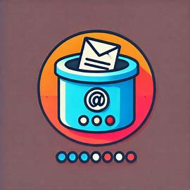
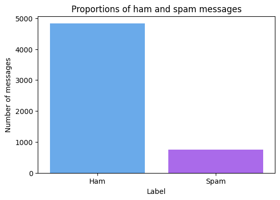
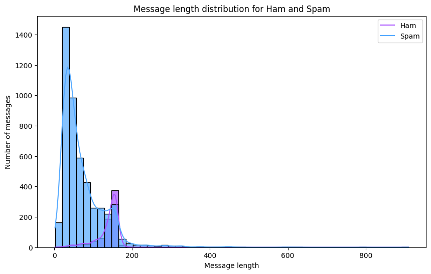

# 📧 Spam Detection with Machine Learning 💻

Welcome to the **Spam Detection** project! 🚀 This repository contains a Python implementation of a machine learning model that classifies SMS messages as **spam** 🛑 or **ham** ✅ (not spam). 



---

## ✨ Features

- 🔍 **Spam Classification**: Detect whether an SMS message is spam or not.
- 📊 **Data Visualization**: Gain insights into the dataset with beautiful visualizations.
- 📈 **High Accuracy**: Uses the Naive Bayes algorithm for text classification.
- 🛠️ **Customizable**: Test the model with your own custom messages.

---

## 📂 Dataset

The dataset is the **SMS Spam Collection**, containing 5,572 labeled SMS messages:
- ✅ **Ham**: Regular messages (non-spam).
- 🛑 **Spam**: Unsolicited promotional or fraudulent messages.

---

## 🛠️ Installation

Clone this repository:
   ```bash
   git clone https://github.com/mzums/spam_detection
   cd spam_detection
   ```

---

## 🏃‍♂️ Quick Start

1. Run the script:
   ```bash
   python main.py
   ```

2. 🎨 Explore dataset visualizations:
   - 📊 Proportions of spam vs ham messages.
   - 📏 Distribution of message lengths.

3. ✉️ Test the model with your own custom messages:
   ```python
   custom_message = "You've won a free holiday! Call us now to claim."
   print(f"Message: '{custom_message}' is classified as: {predict_message(custom_message)}")
   ```

---

## 📊 Visualizations

1. **Proportions of Spam vs Ham** 📊
   - See the balance of spam and ham messages in the dataset.



2. **Message Length Distribution** 📏
   - Observe how the length of messages varies between spam and ham.



---

## 🔧 Technologies Used

- 🐍 **Python 3.12**
- 📚 **Scikit-learn** for machine learning.
- 🎨 **Matplotlib** and **Seaborn** for data visualization.
- 🧠 **Naive Bayes Algorithm** for classification.

---

## 🛡️ License

This project is licensed under the **MIT License**. 📝 Feel free to use and modify it!

---

## 🤔 Want to Contribute?

We welcome contributions! 🌟 Feel free to fork the repository, make your improvements, and open a pull request. Let's build a better spam detector together! 🤝

---

## 📬 Contact

For questions or feedback, feel free to reach out via email or open an issue. 💌

Happy coding! 🎉